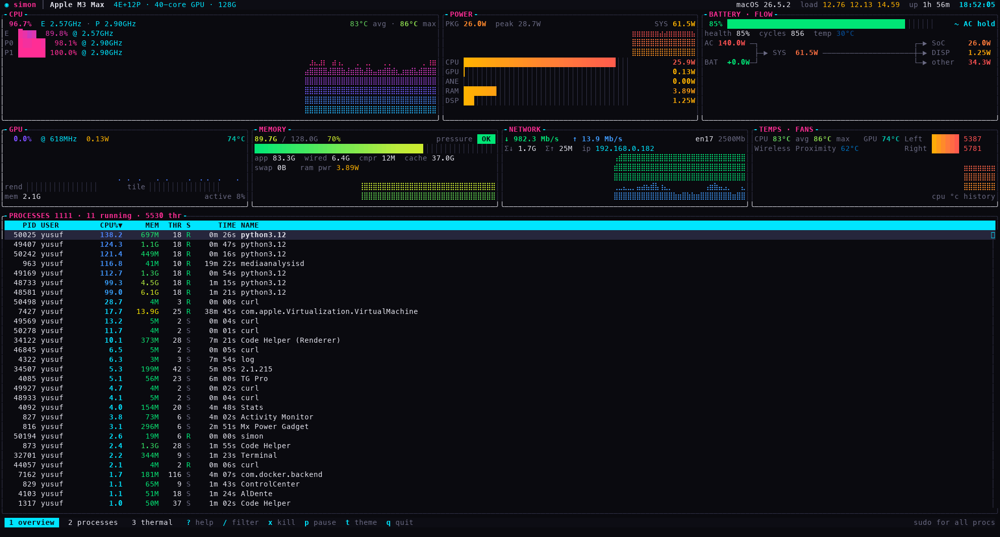
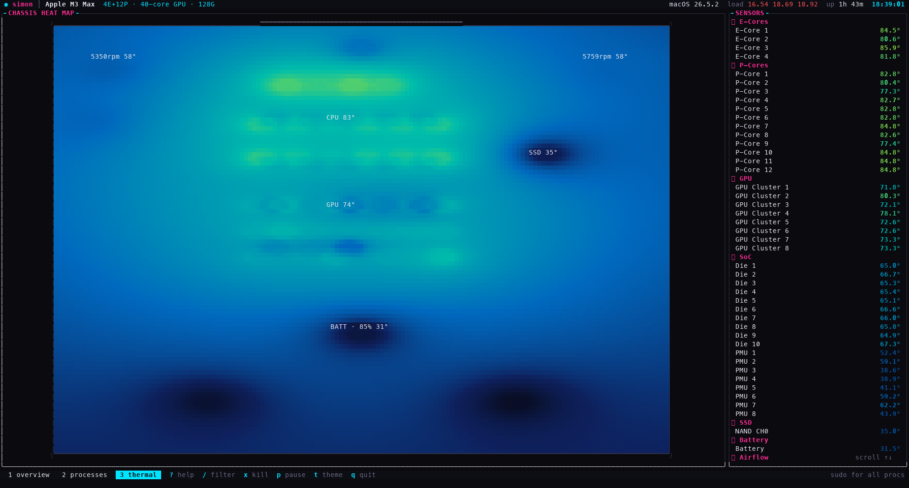
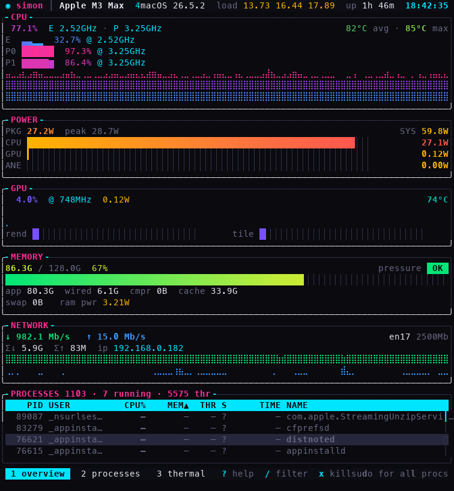

<div align="center">

# ◉ mxmon

The **Mx** **mon**itor — a blazing-fast, **sudoless** system monitor for Apple Silicon, living in your terminal.


[](https://ratatui.rs)

[](LICENSE)



[Features](#features) · [Install](#install) · [Keys](#keys) · [How it works](#how-it-works) · [Themes](#themes)

</div>

---

`mxmon` fuses htop's process management with Mx-Power-Gadget-class SoC telemetry, a live network panel, an AlDente-style battery power-flow, and a real-time **thermal map of your MacBook's chassis** — all in a neon terminal UI that redraws only when data changes, so it sips CPU when idle. Everything is read straight from macOS frameworks: **no `sudo`, no kexts, no daemons.**

## Features

|  |  |
|---|---|
| **CPU** — per-cluster E/P meters, live DVFS frequencies from IOReport residencies, utilization history, core temps | **Power** — PKG / CPU / GPU / ANE / RAM / display rails in watts, with history, peaks, and total system power from the SMC |
| **GPU** — Activity-Monitor-matching utilization, frequency, render/tiler meters, VRAM, temperature | **Memory** — Activity Monitor's exact formula (app + wired + compressed), cached files, swap, kernel pressure |
| **Network** — live ↓/↑ rates, stacked graphs, session totals, primary interface, link speed, local IP | **Battery flow** — charge, health, cycles, temp + adapter → system → SoC / display power-flow diagram |
| **Chassis heat map** — a live thermogram from 50+ die & board sensors, pinned at their physical positions | **Processes** — sortable / filterable table, real `phys_footprint` memory, CPU %, a real **watts** column, threads, kill w/ signal picker |
| **Disk** — R/W throughput graphs, IOPS, and true per-op device latency from the block-storage drivers | **Connections** — every process's live TCP/UDP flows with rates, RTT and retransmit % — `nettop`-class data, plus per-process ↓/↑ columns |

<sub>The <b>PWR</b> column is real physics, not a score: per-process energy counters (nanojoules, split by P/E cluster) that macOS otherwise only surfaces through <code>sudo powermetrics</code>. Sort by it to see what's actually eating the battery — a renderer at 46% CPU on E-cores can cost 76 mW while a 30% P-core process burns a full watt. <kbd>Enter</kbd> shows IPC, core mix, and disk/net IO per process.</sub>

<div align="center">



<sub>Press <kbd>3</kbd> for the full-screen <b>thermogram</b> — 50+ sensors interpolated across a scale model of the chassis and eased between samples, with a TG-Pro-style named sensor list.</sub>

</div>

## Install

> Apple Silicon Mac. Homebrew and the prebuilt binary need no toolchain; `cargo install` and source builds need [Rust](https://rustup.rs) 1.88+.

**Homebrew**

```sh
brew install yusufmo1/tap/mxmon
```

**Cargo**

```sh
cargo install mxmon
```

**Prebuilt binary** — download the latest `mxmon-aarch64-apple-darwin.tar.gz` from [Releases](https://github.com/yusufmo1/mxmon/releases):

```sh
tar -xzf mxmon-aarch64-apple-darwin.tar.gz && ./mxmon
```

**From source**

```sh
git clone https://github.com/yusufmo1/mxmon && cd mxmon
cargo build --release && ./target/release/mxmon
```

<sub>The crate, binary, Homebrew formula, and GitHub repo are all named <code>mxmon</code>. Unsigned prebuilt binaries are Gatekeeper-quarantined on first launch — clear it with <code>xattr -d com.apple.quarantine ./mxmon</code>, or use Homebrew / <code>cargo install</code>, which aren't affected.</sub>

> [!TIP]
> Like htop, mxmon shows CPU / memory for **your** processes without privileges. `sudo mxmon` unlocks those columns for every process — but all hardware telemetry works sudoless either way.

### Flags

| Flag | Description |
|---|---|
| `--json` | print one JSON snapshot of every metric and exit (scripting / tests) |
| `--interval <MS>` | fast-tier sampling interval, `100`–`2000` ms |
| `--theme <NAME>` | launch with any of the 17 built-in [themes](#themes) |

## Keys

| Keys | Action |
|---|---|
| <kbd>1</kbd> <kbd>2</kbd> <kbd>3</kbd> <kbd>4</kbd> / <kbd>Tab</kbd> | overview · processes · thermal · connections |
| <kbd>j</kbd> <kbd>k</kbd> / arrows · <kbd>g</kbd> <kbd>G</kbd> | select · jump to top / bottom |
| <kbd>/</kbd> or <kbd>F3</kbd> | filter (<kbd>Esc</kbd> clears) |
| <kbd>s</kbd> / <kbd>F6</kbd> / click header | sort |
| <kbd>x</kbd> / <kbd>F9</kbd> | kill (signal picker) |
| <kbd>Enter</kbd> | process details |
| <kbd>o</kbd> | settings — process panes · theme · sampling · ping |
| <kbd>t</kbd> | cycle theme |
| <kbd>p</kbd> · <kbd>+</kbd> <kbd>-</kbd> · <kbd>d</kbd> | pause · sampling speed · debug HUD |
| <kbd>?</kbd> · <kbd>q</kbd> | help · quit |

<sub>Full mouse support: click tabs, column headers, rows and footer buttons; scroll the process and sensor lists.</sub>

<div align="center">



<sub>Reflows cleanly all the way down to narrow terminals.</sub>

</div>

## How it works

Every reading comes straight from a macOS framework — no helper process, no elevated privileges.

<details>
<summary><b>Data sources</b> — all sudoless</summary>

<br>

| Metric | Source |
|---|---|
| Power, frequencies | private `IOReport` framework (energy + DVFS residency counters) |
| Temperatures | IOHID sensor services + SMC (per-chip key maps for M1 / M2 / M3) |
| Fans, system & adapter power | SMC (`F*Ac`, `PSTR`, `PDTR`) |
| GPU utilization | IOKit `AGXAccelerator` performance statistics |
| Per-core CPU | `host_processor_info` tick deltas |
| Memory | `host_statistics64` (Activity Monitor's formula) |
| Network | `NET_RT_IFLIST2` interface counters (wrap-aware) |
| Disk I/O | `IOBlockStorageDriver` statistics in the IORegistry |
| Per-connection flows | `com.apple.network.statistics` kernel-control socket (ntstat) |
| Processes | bulk `sysctl KERN_PROC_ALL` + `libproc` task info / rusage |
| Per-process watts / IPC | `proc_pid_rusage` `RUSAGE_INFO_V6` energy & cycle counters |

Every `unsafe` FFI call lives under `src/ffi/`; the rest of the crate is `#![deny(unsafe_code)]`.

</details>

<details>
<summary><b>Sampling & efficiency</b></summary>

<br>

Sampling is **tiered** so expensive reads don't run more often than they need to:

| Tier | Interval | What |
|---|---|---|
| Fast | 250 ms | CPU · GPU · memory · network · disk |
| Power | 500 ms | IOReport power · SMC temps |
| Slow | 1 s | HID die sensors · battery · connection flows |
| Procs | 2 s | full process table (incl. per-process watts) |

All tiers scale together with <kbd>+</kbd> / <kbd>-</kbd>. The heat surface is cached and eased on the fast tier, and the UI **only redraws on new data or input**, so idle cost stays near zero. Config persists at `~/.config/mxmon/config.toml`.

</details>

<details>
<summary><b>A note on network counters</b></summary>

<br>

Modern macOS quantizes and 32-bit-wraps `NET_RT_IFLIST2` byte counters for ad-hoc-signed binaries (found empirically — Apple-signed tools see the real 64-bit values). mxmon therefore computes rates via **wrap-aware deltas** and reports **session** totals, which stay exact regardless of code signature.

</details>

## Themes

**17 built-in themes** — cycle live with <kbd>t</kbd>, or launch with `--theme <name>`:

`neon` (default) · `synthwave` · `cyberpunk` · `dracula` · `tokyonight` · `catppuccin` · `nord` · `gruvbox` · `everforest` · `kanagawa` · `onedark` · `monokai` · `rosepine` · `solarized`

…plus three light themes for daylight terminals — `latte` · `solarized-light` · `gruvbox-light`.

On truecolor terminals the thermogram samples the raw thermal ramp; on 256-color terminals (Terminal.app) it walks a hand-curated monotonic path through the xterm color cube — clean isotherm contours instead of quantization noise.

## Credits

The sudoless IOReport / SMC approach follows the excellent MIT-licensed [vladkens/macmon](https://github.com/vladkens/macmon). Per-chip SMC temperature-key curation follows [exelban/stats](https://github.com/exelban/stats). Built with [ratatui](https://ratatui.rs).

<div align="center">
<br>
<sub><b>MIT</b> © 2026 Yusuf · built for Apple Silicon</sub>
</div>
